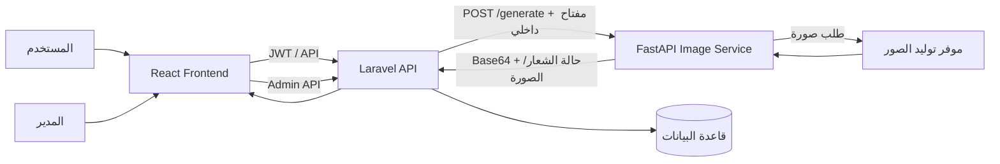

# Styloraify AI Fashion Studio

**Styloraify** هي منصة عربية لتصميم الأزياء بالذكاء الاصطناعي. تتيح للمستخدم إنشاء تصاميم لقطع محددة، تخصيص الوصف واللون وزاوية العرض، إدخال شعار أو صورة مستخدم ضمن طلب التوليد، ثم حفظ التصميم أو طلبه ومتابعة الإشعارات. كما تتضمن لوحة إدارة لإدارة المستخدمين والتصاميم والطلبات والكوبونات وتصاميم العرض.

> **حالة هذه النسخة:** دُمجت تحديثات الواجهة والخلفية وخدمة الصور المرفقة في الفرع `main`. نجح بناء واجهة الإنتاج وفحص صياغة خدمة Python. تبقى اختبارات Laravel وتكامل موفر الذكاء الاصطناعي غير منفذة في بيئة المراجعة الحالية لغياب PHP/Composer وبيانات الاعتماد التشغيلية؛ التفاصيل موجودة في [`docs/VERIFICATION.md`](docs/VERIFICATION.md).

| الطبقة | المسار | المسؤولية |
|---|---|---|
| واجهة المستخدم | [`frontend/`](frontend/) | تطبيق React مع CRACO وTailwind ومكونات Radix، ويخدم رحلة المستخدم ولوحة الإدارة. |
| واجهة Laravel | [`backend-laravel/`](backend-laravel/) | المصادقة، التصاميم، الطلبات، الكوبونات، التصاميم المعروضة، الإشعارات وواجهات الإدارة. |
| خدمة الصور | [`backend-laravel/image-ai-service/`](backend-laravel/image-ai-service/) | خدمة FastAPI لتوليد الصورة وتركيب الشعار وصورة المستخدم وإعادة النتيجة بترميز Base64. |
| مخطط البيانات | [`backend-laravel/database/`](backend-laravel/database/) | migrations وseeders لعناصر المستخدمين والتصاميم والطلبات والكوبونات والإشعارات. |
| التوثيق | [`docs/`](docs/) | معمارية وتشغيل وتحقق وسجل تغييرات النسخة الحالية. |

## المعمارية وتدفق البيانات

تتواصل واجهة React مع API Laravel عبر متغيرات `REACT_APP_*`. تستقبل Laravel طلبات التوليد المحمية، وتفوض إنشاء الصورة إلى خدمة FastAPI الداخلية عبر `AI_SERVICE_URL`. تستخدم خدمة الصور مزود التوليد المعرّف في بيئة النشر، ثم تدمج الشعار أو صورة المستخدم عندما تكون البيانات متاحة وصحيحة، وتعيد النتيجة إلى Laravel ثم الواجهة. تبقى مفاتيح التكامل على الخادم فقط ولا تُضمّن في بناء React.

| النطاق الوظيفي | المكوّنات الرئيسة | السلوك |
|---|---|---|
| المصادقة | `AuthController` و`OAuthController` و`GoogleLoginButton` | تسجيل ودخول محليان وتكامل Google OAuth اختياري، مع حفظ رمز الجلسة في الواجهة. |
| إنشاء التصميم | `DesignController` و`DesignService` و`image_generator.py` | معاينة/توليد التصميم، التحقق من المدخلات، وحفظ التصميمات الناتجة. |
| تخصيص الصورة | `image_generator.py` | إزالة خلفية الشعار، مواءمته مع منحنى القطعة وإضاءتها، وتركيب صورة المستخدم عند توفرها. |
| المتجر والطلبات | `OrderController` و`CouponController` و`ShowcaseController` | إنشاء طلب، استخدام كوبون، متابعة الطلب، وعرض تصميمات مختارة. |
| لوحة الإدارة | متحكمات `Admin/*` و`AdminDashboard` | إحصاءات وإدارة طلبات ومستخدمين وتصاميم وكوبونات وتصاميم العرض. |
| الإشعارات | `NotificationController` والأحداث والمستمعات | حفظ وإظهار إشعارات مرتبطة بالأحداث التجارية والتصميمية. |

## بدء التشغيل المحلي

تحتاج المنصة إلى ثلاث عمليات مستقلة: خادم Laravel، واجهة React، وخدمة FastAPI. استخدم حسابات وقيم تطوير فقط، ولا ترفع أي ملفات `.env` أو مفاتيح موفر الصور أو Google OAuth إلى Git.

| الخدمة | الدليل | الإجراء المعتاد | المنفذ المرجعي |
|---|---|---|---|
| Laravel | `backend-laravel/` | تثبيت Composer، إنشاء `.env`، ضبط قاعدة البيانات، تشغيل migrations ثم خادم التطبيق. | 8000 |
| React | `frontend/` | `npm install` ثم `npm start` للتطوير أو `npm run build` لإنتاج bundle. | 3000 افتراضيًا |
| FastAPI | `backend-laravel/image-ai-service/` | إنشاء بيئة Python افتراضية، تثبيت `requirements.txt`، وضبط متغيرات البيئة ثم تشغيل Uvicorn. | 8002 |

### متغيرات البيئة الأساسية

| المجال | المتغير | الغرض |
|---|---|---|
| الواجهة | `REACT_APP_BACKEND_URL` | أصل خادم Laravel المستخدم لمسارات API. |
| الواجهة | `REACT_APP_API_URL` | عنوان API عند استخدامه من وحدات الواجهة. |
| الواجهة | `REACT_APP_GOOGLE_CLIENT_ID` | معرف عميل Google OAuth العام؛ لا يُعد سرًا لكنه يجب أن يطابق نطاقات النشر. |
| Laravel | `AI_SERVICE_URL` | عنوان خدمة FastAPI الداخلية؛ الإعداد الافتراضي يشير إلى `http://127.0.0.1:8002`. |
| Laravel وخدمة الصور | `INTERNAL_SERVICE_KEY` | سر مشترك اختياري لحماية اتصال Laravel بخدمة الصور. |
| خدمة الصور | `ALLOWED_ORIGINS` | أصول CORS المسموح بها؛ استخدم نطاقات محددة في الإنتاج. |
| موفر الصور | بيانات اعتماد موفر التوليد | تُحقن في بيئة خدمة الصور فقط، ولا توضع في React أو المستودع. |

> خدمة الصور تستورد موفرًا باسم `emergentintegrations` عند تنفيذ التوليد. الملف [`requirements.txt`](backend-laravel/image-ai-service/requirements.txt) يوثق الاعتماديات العامة، لكن يجب أن يوفر فريق النشر حزمة/مستودع موفر التوليد المتوافق وبيانات اعتماده قبل تفعيل endpoint الحقيقي.

## التحقق الحالي

| الاختبار | الحالة | الملاحظة |
|---|---|---|
| `npm run build` في `frontend/` | ناجح | أنتج bundle إنتاجيًا بنجاح بعد دمج الواجهة وتكامل Google OAuth. |
| React test runner | يعمل، ولا توجد ملفات اختبار مطابقة | أُجري الأمر مع `--passWithNoTests` لتأكيد إعداد runner دون ادعاء وجود تغطية اختبار. |
| فحص صياغة FastAPI | ناجح | تم التحقق من صياغة `image_generator.py` دون تشغيل الخادم أو الاتصال بمزود خارجي. |
| Laravel/PHPUnit | غير منفذ | تتوفر ملفات Laravel والاختبارات، لكن PHP وComposer غير متاحين في بيئة المراجعة. |
| التوليد الحقيقي وGoogle OAuth | غير منفذ | يتطلبان أسرارًا ونطاقات/حسابات موثقة في بيئة تشغيل معزولة. |

## الملفات المضافة في هذه النسخة

تمت إضافة أو تحديث متحكمات وطلبات Form Request وAPI Resources وأحداث ومستمعات Laravel، وخدمة الصور، وواجهة التصميم ولوحة الإدارة والمصادقة عبر Google. أُصلحت كذلك ثلاثة أسماء ملفات Form Request غير متوافقة مع PSR-4 قبل الدمج كي تعمل آلية التحميل التلقائي في Laravel.

| الوثيقة | المحتوى |
|---|---|
| [`docs/ARCHITECTURE.md`](docs/ARCHITECTURE.md) | تفصيل الطبقات وتدفقات التوليد والبيانات والوظائف الإدارية. |
| [`docs/OPERATIONS.md`](docs/OPERATIONS.md) | إعداد كل خدمة، النسخ الاحتياطي، النشر، واستجابة الأعطال. |
| [`docs/VERIFICATION.md`](docs/VERIFICATION.md) | النتائج الفعلية للفحص، ما لم يُختبر، وقائمة قبول قبل الإنتاج. |
| [`docs/CHANGELOG.md`](docs/CHANGELOG.md) | ملخص الملفات والميزات التي أضيفت في هذه النسخة. |

## الأمان والنشر

احفظ الأسرار في مدير أسرار أو متغيرات بيئة محمية، واستخدم HTTPS وCORS مقيدًا ونطاقات Google OAuth صحيحة في الإنتاج. أبقِ خدمة FastAPI على شبكة خاصة خلف Laravel أو reverse proxy موثوق، وفعل `INTERNAL_SERVICE_KEY` متطابقًا على جانبي الاتصال. تستبعد قواعد Git ملفات البيئة وقواعد SQLite المحلية ومخرجات البناء ووسائط التشغيل المؤقتة.
