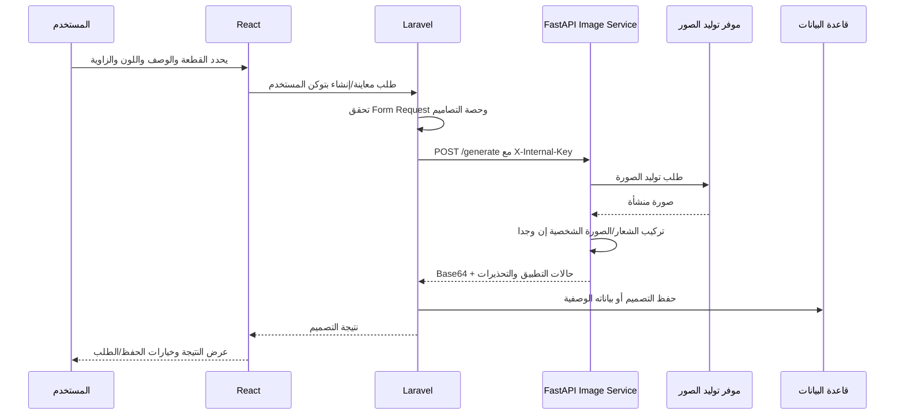

# معمارية Styloraify

## 1. المكونات الأساسية

تعتمد Styloraify على فصل واضح بين الواجهة، ومنطق الأعمال، ومعالجة الصور. تعرض واجهة React رحلة التصميم والإدارة، وتنفذ Laravel المصادقة وحفظ البيانات والقرارات التجارية، بينما يعالج FastAPI طلبات الصور الثقيلة والاتصال بموفر التوليد. هذا الفصل يمنع وضع مفاتيح التوليد أو معالجة الصور داخل المتصفح، ويسمح بتوسيع خدمة الصور بصورة مستقلة عن API المستخدمين.

| المكوّن | المسار | التقنية | المسؤولية |
|---|---|---|---|
| تطبيق العميل والإدارة | [`frontend/`](../frontend/) | React، CRACO، Tailwind، Radix | صفحات الهبوط واللوحة والتصميم والطلبات والإدارة والإشعارات. |
| API الأعمال | [`backend-laravel/`](../backend-laravel/) | Laravel | JWT والمستخدمون والتصاميم والطلبات والكوبونات والتصاميم المعروضة والإشعارات. |
| محرك الصور | [`backend-laravel/image-ai-service/`](../backend-laravel/image-ai-service/) | FastAPI، Pillow، NumPy | توليد الصورة، تركيب الشعار والصورة الشخصية، والتحويل Base64. |
| التخزين | migrations في [`backend-laravel/database/`](../backend-laravel/database/) | قاعدة البيانات التي يختارها Laravel | كيان المستخدم والتصميم والطلب والكوبون والاستخدام والإشعار وتصميم العرض. |

## 2. تدفق إنشاء التصميم

يتحقق Laravel من مدخلات التصميم وحصة المستخدم قبل استدعاء الخدمة الداخلية. لا ينبغي أن يتصل المتصفح مباشرة بخدمة FastAPI في الإنتاج؛ يمر الطلب عبر Laravel حتى يبقى التحكم في الهوية والحصة والسجل وإدارة الأسرار داخل الخادم.

| مرحلة | الملف/الطبقة | الضوابط |
|---|---|---|
| التحقق | `PreviewDesignRequest` و`SaveDesignRequest` | يفصل التحقق عن المتحكم ويضع حدودًا للمدخلات قبل المعالجة. |
| التفويض | `DesignController` و`DesignPolicy` | يقيد عمليات التصميم بالمستخدم أو الصلاحية المناسبة. |
| الاستدعاء الداخلي | `DesignService` | يستخدم `AI_SERVICE_URL` و`INTERNAL_SERVICE_KEY` للاتصال بالخدمة الداخلية. |
| المعالجة | `image_generator.py` | يفك Base64 ويعالج الشعار والصورة ويعيد حقول نجاح/تحذير منفصلة. |
| الاستمرارية | `Design` و`DesignResource` | يحفظ/يعرض البيانات المطلوبة للواجهة بعد اكتمال العملية. |

## 3. خدمة الصور

تعرض خدمة FastAPI endpoint صحيًا وendpoint توليد. تقبل بنية الطلب الوصف والقطعة واللون ونوع زاوية العرض، إضافة إلى شعار وصورة مستخدم اختياريين بصيغة Base64. تعيد الخدمة مؤشرات مستقلة عن نجاح تطبيق الشعار أو صورة المستخدم حتى لا تفترض الواجهة أن أي معالجة اختيارية نجحت بمجرد نجاح إنشاء الصورة الأساسية.

| قدرة | السلوك |
|---|---|
| تحسين الشعار | إزالة خلفية مسطحة، قص الحواف الشفافة، تحجيم متناسب، وتشويه خفيف يتوافق مع انحناء القطعة. |
| دمج الإضاءة | استخدام منطقة القماش تحت الشعار للمزج البصري بدل لصق شعار مسطح بلا سياق. |
| صورة المستخدم | تقبل صورة اختيارية من الواجهة ضمن عقد الطلب لمعالجة سيناريو المعاينة الشخصية. |
| الحماية | تحقق اختياري من `X-Internal-Key` عندما يكون `INTERNAL_SERVICE_KEY` مضبوطًا. |
| CORS | قيمة `ALLOWED_ORIGINS` تحدد الأصول المسموحة؛ لا تستخدم `*` مع credentials في الإنتاج. |

> **حدود التكامل:** تستدعي الخدمة مزودًا من `emergentintegrations` داخل endpoint التوليد. هذا الموفر ليس جزءًا من الشفرة المرفقة، ولذلك يجب أن يورده فريق النشر من مصدره المعتمد قبل تفعيل التوليد الفعلي.

## 4. API والوظائف التجارية

تنقسم API إلى مسارات المستخدم ومسارات المدير. تضيف النسخة الحالية Form Requests وAPI Resources لتقليل تكرار التحقق وتوحيد شكل الاستجابة، كما تضيف أحداثًا ومستمعات لربط التغييرات المهمة بالإشعارات والسجل التشغيلي.

| المجال | نقاط التنفيذ | النتيجة |
|---|---|---|
| المستخدم والهوية | `AuthController` و`OAuthController` وطلبات `Auth/*` | تسجيل وإنشاء حساب وتكامل Google OAuth اختياري. |
| التصاميم | `DesignController` و`DesignService` وطلبات `Designs/*` | معاينة وحفظ وإدارة تفضيلات التصميم. |
| الطلبات والكوبونات | `OrderController` و`CouponController` و`CreateOrderRequest` | إنشاء طلب، التحقق من الكوبون، وتسجيل الاستخدام. |
| التصاميم المعروضة | `ShowcaseController` و`ShowcaseDesign` | عرض واختيار التصاميم الترويجية. |
| الإدارة | متحكمات `Admin/*` وطلبات `Admin/*` | إدارة المستخدمين والحصص والطلبات والتصاميم والكوبونات. |
| الإشعارات | `NotificationController` والأحداث والمستمعات | إنشاء وإظهار وإدارة إشعارات مرتبطة بالدخول والتصميم والطلب والكوبون. |

## 5. الواجهة

تستخدم الواجهة React Router لتقسيم المسارات العامة ولوحة المستخدم ولوحة المدير. تضيف النسخة [`GoogleLoginButton`](../frontend/src/components/GoogleLoginButton.jsx) المعتمد على `@react-oauth/google`، ولذلك يتطلب التشغيل ضبط `REACT_APP_GOOGLE_CLIENT_ID` وقبول نطاقات redirect الصحيحة في إعداد Google Cloud. تستخدم الواجهة `REACT_APP_BACKEND_URL` و`REACT_APP_API_URL` بدل عناوين ثابتة، وهو ما يسمح بفصل بيئات التطوير والاختبار والإنتاج.

| الصفحة | المسؤولية |
|---|---|
| `LandingPage` | تعريف المنصة ومسار الدخول/التسجيل. |
| `Dashboard` | اختيار القطعة، ضبط التصميم، رفع الشعار أو الصورة، عرض النتيجة، وإدارة التصميمات والطلبات. |
| `AdminDashboard` | إحصاءات وإدارة المستخدمين والطلبات والتصاميم والكوبونات وتصاميم العرض. |
| `ShowcaseManager` | إدارة المحتوى البصري المخصص للعرض. |

## 6. قواعد الصيانة

عند إضافة endpoint جديد، أضف Form Request وResource عند الحاجة، وحدد سياسة الوصول قبل كتابة منطق الأعمال. لا تمرر Base64 كبيرًا بلا حدود، ولا تنقل token أو مفتاح موفر الصور إلى React. عند تغيير عقد `/generate`، حدث `ImageRequest` في FastAPI و`DesignService` وواجهة Dashboard معًا، ثم أضف اختبار قبول للتدفق الكامل في بيئة تتوفر فيها بيانات اختبار مزودة.
